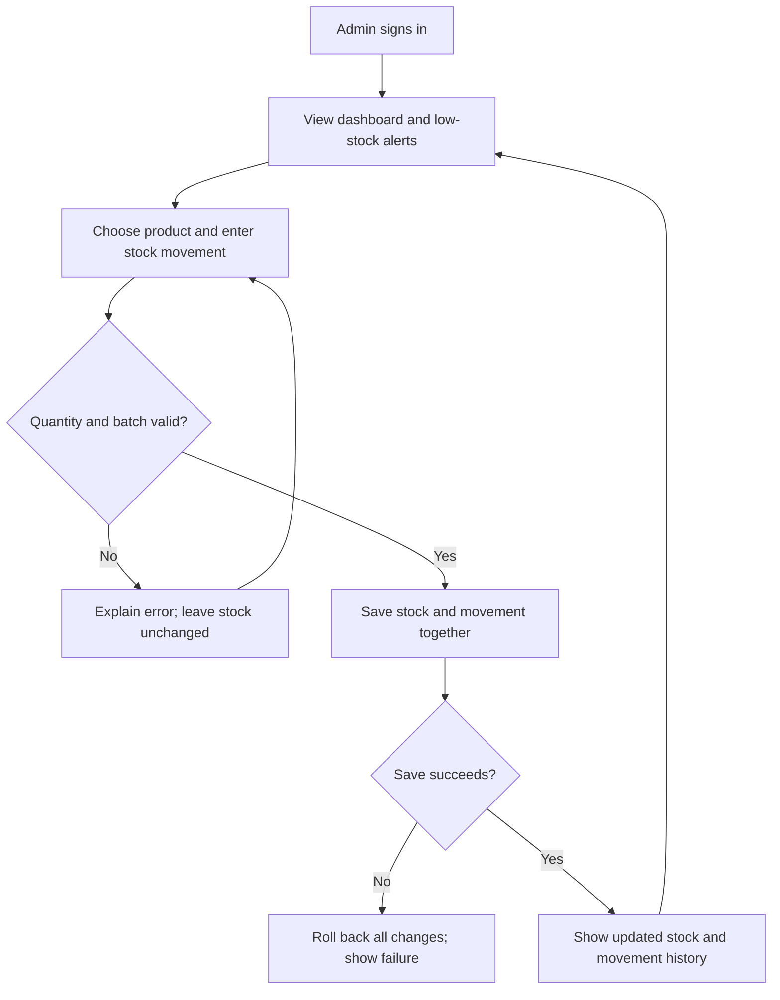
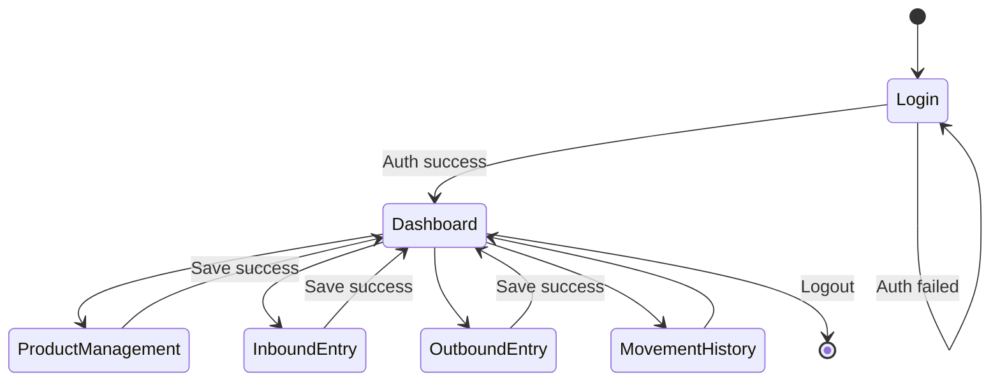
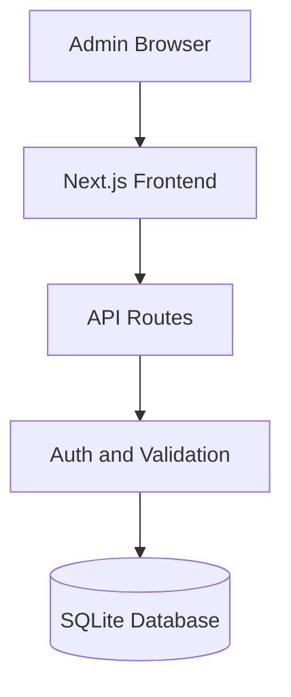
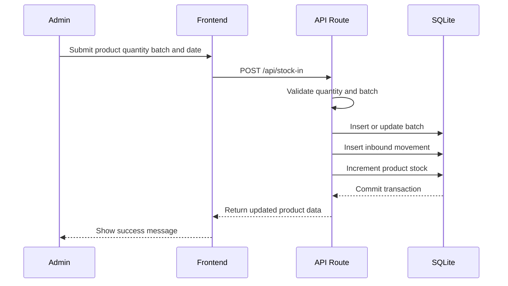
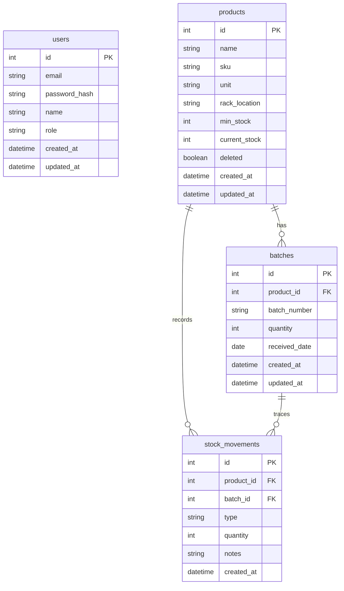

# Warehouse Inventory App PRD

## 1. Overview

### Layer 1: Human PRD

| Field | Content |
|-------|---------|
| Problem Statement | Warehouse stock is tracked manually or in scattered files, making it hard for a single warehouse admin to know real-time stock, rack location, batch numbers, and inbound/outbound history. |
| Proposed Solution | Build a small web app where one admin can manage products, record inbound and outbound stock by batch, view low-stock alerts, and review movement history from a dashboard. |
| Target User | A single warehouse admin who manages physical stock daily, uses a desktop browser, and needs fast manual data entry without a barcode scanner. |
| Decisions and assumptions | Single-admin SQLite storage limits operational complexity at the stated scale; MVP, future scope, and exclusions are specified in Milestones. This is an illustrative draft, not an owner-approved target. |
| Research basis | UNVERIFIED - stack versions and runtime compatibility require the Architecture checks; this example contains no observed application runtime evidence. |

### Goals & Success Metrics

| Goal | Metric | Target Value | Measurement Method |
|------|--------|--------------|--------------------|
| Digitize stock records | Products recorded digitally | 100% of active products | Product table audit |
| Speed up stock checks | Time to check item stock | Under 5 seconds | Manual timing from dashboard/search |
| Improve low-stock visibility | Low-stock alert accuracy | 100% for products below minimum stock | Compare dashboard with product records |
| Preserve batch traceability | Movements with batch ID | 100% of inbound/outbound movements | Movement log audit |

### Layer 2: Machine Spec

| Constraint | Value |
|------------|-------|
| Platform | Web app, desktop-first, responsive fallback |
| User Model | Single admin with full access |
| Input Method | Manual keyboard entry |
| Language | English UI in this example; source concept supports Indonesian UI |
| Deployment | Docker container on one VPS |
| Storage | SQLite for small single-admin inventory scale |

## 2. Requirements

### Functional Requirements

| ID | Requirement | Priority | Rationale | Acceptance Criteria IDs |
|----|-------------|----------|-----------|-------------------------|
| FR-001 | Admin can sign in and sign out. | Must | Inventory data must not be public. | AC-001, AC-002 |
| FR-002 | Admin can create, edit, search, and soft-delete products. | Must | Product master data is the basis for stock tracking. | AC-008, AC-009, AC-010, AC-011, AC-012 |
| FR-003 | Admin can record inbound stock with quantity, batch number, and received date. | Must | Batch-level inbound records are required for traceability. | AC-013, AC-014, AC-015, AC-016, AC-017, AC-018 |
| FR-004 | Admin can record outbound stock against an available batch. | Must | Stock must decrease from a real batch without going negative. | AC-019, AC-020, AC-021, AC-022, AC-023, AC-024 |
| FR-005 | Dashboard shows low-stock alerts. | Must | The admin needs immediate visibility into replenishment needs. | AC-003, AC-004, AC-005, AC-006, AC-007 |
| FR-006 | Admin can view movement history with filters. | Should | Auditing requires chronological inbound/outbound records. | AC-025, AC-026, AC-027, AC-028, AC-029 |
| FR-007 | Product search supports name and SKU. | Should | Fast lookup matters for daily warehouse work. | AC-012 |

### Non-Functional Requirements

| ID | Category | Requirement | Target | Acceptance Criteria IDs |
|----|----------|-------------|--------|-------------------------|
| NFR-001 | Performance | Dashboard loads quickly for a small warehouse dataset. | Under 2 seconds for 1,000 products and 10,000 movements. | AC-006 |
| NFR-002 | Reliability | Stock changes must be transactional. | Product, batch, and movement updates succeed or fail together. | AC-018, AC-024 |
| NFR-003 | Security | Passwords must be hashed and sessions protected. | No plaintext passwords; protected routes require a valid session. | AC-001, AC-002 |
| NFR-004 | Validation | Quantities cannot be zero, negative, or above available stock. | Invalid submissions are rejected before persistence. | AC-014, AC-020 |

### Conditional Reliability Contracts

| Contract | Required Detail | Acceptance Evidence or N/A |
|---|---|---|
| Authority and modes | The authenticated admin may create movements and edit product metadata; the UI cannot bypass API validation; no AI or external executor has mutation authority. | Negative API tests prove unauthenticated, invalid, duplicate, and over-stock requests create no movement or stock change. |
| State and history | `stock_movements` is immutable history; product/batch stock is the authoritative aggregate; dashboard cards are derived projections; soft-delete preserves history. | Transaction, projection-consistency, and migration tests compare aggregates with movement history. |
| Providers and sources | N/A - the MVP has no external inventory provider or producer-consumer event bridge. | N/A - local database and authenticated HTTP interfaces are covered elsewhere. |
| Scheduling and recovery | N/A - the MVP has no scheduler or durable background worker; transactional requests recover by rollback. | A forced failure proves product, batch, and movement writes roll back together. |
| Sessions and operations | Browser auth sessions expire/revoke independently from inventory records; deployment health cannot be inferred from config presence. | Host smoke proves login, protected route, database access, health, and clean shutdown against one source fingerprint. |
| Observation and resources | Dashboard and history queries are indexed, paginated, and bounded to the stated dataset/latency targets; deep database integrity checks are not part of frequent health. | Query-plan and load receipt for 1,000 products and 10,000 movements. |
| Notification and analytics | N/A - MVP has no push delivery or hypothetical analytics; low-stock cards are derived operational projections only. | Dashboard/API consistency test covers the derived low-stock projection. |

## 3. Core Features

### Feature 1: Admin Authentication

**Layer 1: Human PRD**
Only the configured warehouse admin can access inventory data or mutation
interfaces.

**Layer 2: Machine Spec**

| Item | Specification |
|------|---------------|
| Inputs | Email and password |
| Outputs | Protected session or generic authentication error |
| Data Dependencies | `users`, server-side sessions |
| UI Components | Login page, logout control, session-expired message |
| Failure Handling | Invalid, expired, or absent credentials create no session and expose no inventory data |

**Acceptance Criteria**

| ID | Requirement IDs | Observable Criterion | Required Evidence |
|----|-----------------|----------------------|-------------------|
| AC-001 | FR-001, NFR-003 | Valid configured credentials create a protected session and open the dashboard; the stored password is a one-way hash. | Authentication integration test and sanitized user-row inspection |
| AC-002 | FR-001, NFR-003 | Invalid credentials, an expired session, or a request without a session cannot access protected routes; logout invalidates the active session. | Negative route and session tests |

### Feature 2: Admin Dashboard

**Layer 1: Human PRD**
The dashboard gives the admin one place to see inventory health, especially products below minimum stock.

**Layer 2: Machine Spec**

| Item | Specification |
|------|---------------|
| Inputs | Product and batch records from SQLite |
| Outputs | Summary cards, low-stock table, recent movements |
| Data Dependencies | `products`, `stock_movements` |
| UI Components | Dashboard page, summary cards, low-stock table |
| Failure Handling | Show retry state when dashboard query fails |

**Acceptance Criteria**

| ID | Requirement IDs | Observable Criterion | Required Evidence |
|----|-----------------|----------------------|-------------------|
| AC-003 | FR-005 | Total unique active products are displayed. | Dashboard/API consistency test |
| AC-004 | FR-005 | Every active product with `current_stock < min_stock`, and no product outside that condition, appears in the low-stock table. | Boundary fixture and projection test |
| AC-005 | FR-005 | Recent movement rows are sorted newest first. | Deterministic ordering test |
| AC-006 | FR-005, NFR-001 | Dashboard returns in under 2 seconds for 1,000 products and 10,000 movements in the named test environment. | Source-state-bound load receipt |
| AC-007 | FR-005 | When no products exist, the empty state explains how to add the first product. | Empty-database UI test |

### Feature 3: Product Management

**Layer 1: Human PRD**
The admin can maintain product master data without breaking existing stock history.

**Layer 2: Machine Spec**

| Item | Specification |
|------|---------------|
| Inputs | Name, SKU, unit, rack location, minimum stock |
| Outputs | Product records and searchable product list |
| Data Dependencies | `products` |
| UI Components | Product list, product form, delete confirmation |
| Failure Handling | Duplicate SKU shows a validation error |

**Acceptance Criteria**

| ID | Requirement IDs | Observable Criterion | Required Evidence |
|----|-----------------|----------------------|-------------------|
| AC-008 | FR-002 | Product form rejects missing name, SKU, unit, rack location, or minimum stock before persistence. | Input-validation tests |
| AC-009 | FR-002 | SKU is unique across active products. | Database constraint and duplicate-create test |
| AC-010 | FR-002 | Editing a product does not delete or rewrite movement history. | History-preservation integration test |
| AC-011 | FR-002 | Soft-delete requires confirmation when the product still has stock and preserves its history. | UI/API negative test and database inspection |
| AC-012 | FR-002, FR-007 | Search returns case-insensitive name or exact/prefix SKU matches in under 1 second for the sample dataset. | Search fixture and timing receipt |

### Feature 4: Inbound Stock Entry

**Layer 1: Human PRD**
Inbound entry records new stock with a batch number so the admin can trace where stock came from.

**Layer 2: Machine Spec**

| Item | Specification |
|------|---------------|
| Inputs | Product, quantity, batch number, received date |
| Outputs | New or updated batch, inbound movement, updated product stock |
| Data Dependencies | `products`, `batches`, `stock_movements` |
| UI Components | Searchable product dropdown, inbound form, success toast |
| Failure Handling | Quantity must be greater than zero |

**Acceptance Criteria**

| ID | Requirement IDs | Observable Criterion | Required Evidence |
|----|-----------------|----------------------|-------------------|
| AC-013 | FR-003 | Admin can select an active product from a searchable dropdown. | UI interaction test |
| AC-014 | FR-003, NFR-004 | Zero, negative, fractional, and non-numeric inbound quantities are rejected before persistence. | Boundary validation tests |
| AC-015 | FR-003 | A non-empty batch number and valid received date are required. | Input-validation tests |
| AC-016 | FR-003 | A successful save increments `products.current_stock` by exactly the submitted quantity. | Transaction integration test |
| AC-017 | FR-003 | A successful save creates one immutable `stock_movements` row with type `IN`. | Database assertion |
| AC-018 | FR-003, NFR-002 | A forced failure at any inbound write rolls back batch, product, and movement changes together. | Fault-injection rollback test |

### Feature 5: Outbound Stock Entry

**Layer 1: Human PRD**
Outbound entry prevents accidental negative stock and keeps batch-level history intact.

**Layer 2: Machine Spec**

| Item | Specification |
|------|---------------|
| Inputs | Product, batch, quantity, notes |
| Outputs | Updated batch quantity, outbound movement, updated product stock |
| Data Dependencies | `products`, `batches`, `stock_movements` |
| UI Components | Batch selector, outbound form, insufficient-stock error |
| Failure Handling | Reject when quantity exceeds selected batch stock |

**Acceptance Criteria**

| ID | Requirement IDs | Observable Criterion | Required Evidence |
|----|-----------------|----------------------|-------------------|
| AC-019 | FR-004 | Admin can select only batches with remaining quantity. | UI/API fixture test |
| AC-020 | FR-004, NFR-004 | Zero, negative, fractional, non-numeric, and above-batch outbound quantities are rejected before persistence. | Boundary validation tests |
| AC-021 | FR-004 | A successful save decrements product and selected-batch stock by exactly the submitted quantity. | Transaction integration test |
| AC-022 | FR-004 | A failed save preserves the entered form values and displays the classified error. | UI failure-path test |
| AC-023 | FR-004 | A successful save creates one immutable `stock_movements` row with type `OUT`. | Database assertion |
| AC-024 | FR-004, NFR-002 | A forced failure at any outbound write rolls back product, batch, and movement changes together. | Fault-injection rollback test |

### Feature 6: Movement History

**Layer 1: Human PRD**
The admin can audit every stock movement and answer what changed, when, and why.

**Layer 2: Machine Spec**

| Item | Specification |
|------|---------------|
| Inputs | Date range, product filter, movement type |
| Outputs | Paginated movement table |
| Data Dependencies | `stock_movements`, `products`, `batches` |
| UI Components | Filter toolbar, movement table, pagination |
| Failure Handling | Empty state appears when filters return no rows |

**Acceptance Criteria**

| ID | Requirement IDs | Observable Criterion | Required Evidence |
|----|-----------------|----------------------|-------------------|
| AC-025 | FR-006 | History shows date, product, type, quantity, batch, and notes from immutable movement records. | API/UI contract test |
| AC-026 | FR-006 | Default sort is newest first with ID as the deterministic tie-breaker. | Ordering test with equal timestamps |
| AC-027 | FR-006 | Date-range boundaries include the declared start and end instants in the configured timezone. | Boundary test |
| AC-028 | FR-006 | Product and movement-type filters return only matching movements. | Filter fixture tests |
| AC-029 | FR-006 | Pagination returns 20 rows per page and exposes total/page metadata without unbounded history. | Pagination contract test |

## 4. User Flow

### Primary Flow




### Detailed Steps

| Step | Actor | Action | System Response |
|------|-------|--------|-----------------|
| 1 | Admin | Signs in with email and password. | System validates credentials and opens dashboard. |
| 2 | Admin | Reviews low-stock alerts. | System lists products below minimum stock. |
| 3 | Admin | Creates or updates product master data. | System persists product and prevents duplicate SKU. |
| 4 | Admin | Records inbound stock. | System creates batch and movement log. |
| 5 | Admin | Records outbound stock. | System validates available batch stock and updates quantities. |
| 6 | Admin | Opens movement history. | System shows filtered, paginated movement records. |

### State Diagram



### Edge Cases

| Edge Case | Handling | User Feedback |
|-----------|----------|---------------|
| Outbound quantity exceeds batch stock | Reject transaction and do not change records | Inline error: "Quantity exceeds available batch stock." |
| Duplicate SKU on product create | Reject save before persistence | Inline error with link to existing product |
| Product with stock is soft-deleted | Require confirmation and preserve movement history | Warning modal with current stock |
| Session expires | Redirect to login and preserve intended URL | Message: "Session expired. Sign in again." |
| No products exist | Show empty dashboard state | CTA: "Add first product" |

## 5. Architecture

### System Diagram



### Tech Stack

| Layer | Technology | Version | Rationale | Verification |
|-------|------------|---------|-----------|--------------|
| Frontend | Next.js | Unverified | One project can host UI and API routes. | Confirm before coding |
| Language | TypeScript | Unverified | Reduces runtime mistakes in stock logic. | Confirm before coding |
| Database | SQLite | Unverified | Low-ops storage for single-admin use. | Confirm before coding |
| DB Access | better-sqlite3 | Unverified | Small synchronous transactional database layer for the selected single-host deployment. | Confirm package version before coding |
| Auth | Credential-based session auth | N/A | Single admin does not require OAuth. | Architecture decision |
| Styling | Tailwind CSS | Unverified | Fast dashboard UI implementation. | Confirm before coding |
| Hosting | Docker on one VPS | Unverified | Keeps the SQLite database and application on one persistent host. | Confirm host and persistent-volume contract before coding |

### Builder Capability Routing Contract

Execution mode: native by default. This document specifies the product; act only
on the user's current request. A request to research, review, or plan does not
authorize implementation. Read the complete PRD and target repository instructions
once, then inspect the host-provided available skill/tool catalog. Read matching
skill instructions, check prerequisites, and use available routes or the declared
fallback. Record UNAVAILABLE candidates, chosen routes, affected IDs, and evidence
limits in PROGRESS.md and the final audit. Do not install a skill or change the
coding host/model merely because it is named here.

For a new native build, the user's explicit build request authorizes scoped local
implementation. Record a compact 2-3 outcome plan in PROGRESS.md with this PRD's
version, FR/NFR/AC coverage, required checks, and milestone state; show it and
continue without another routine approval. Make the core path runnable early,
complete all required behavior, and preserve unrelated work. Reuse existing
code/platforms and keep the requested scope, usability, and visual quality intact.
Set status to implementation at build start and advance current_milestone only
after its required evidence passes.

If a toolkit TASKS.json or .prd/task-state.json exists, or the user requests runner
mode, preserve that mode and read the PRD Toolkit runner guide before execution.
One exact plan approval covers declared local runner transitions. Never switch
modes to bypass failure, PLAN_CHANGED, missing runner access, or a state conflict.
Native builds require no toolkit installation; runner-managed builds require the
actual runner and must not fabricate its approvals or evidence.

Diagnose failures before bounded retries. A fallback cannot weaken acceptance
criteria or prove live behavior with mocks or unperformed manual checks. Continue
independent safe work while affected IDs remain UNVERIFIED; do not mark required
behavior complete until proven. Pause only for a blocking decision, material
scope change, or a genuine new authority boundary: external writes, destructive
actions, purchases, credential changes, deployment, production, or owner acceptance.

Finish by running full applicable regression and exercising the intended user
path with material failure/boundary cases. Repair in-scope defects and rerun
affected checks. Write IMPLEMENTATION_AUDIT.md mapping every FR/NFR/AC to expected
behavior, implementation surface, current evidence, and VERIFIED, PARTIAL,
NOT_IMPLEMENTED, or UNVERIFIED status. Include source-state identity, exact
commands/interactions and outcomes, real-versus-mocked coverage, route limitations,
and one next action. Report completion only when all implementation-scoped
requirements and required checks pass; give exact start/test instructions and
current progress. Deployment and final owner acceptance are separate claims.

| Trigger | Required capability | Preferred skill/tool if available | Fallback if unavailable | Required evidence | Authority |
|---|---|---|---|---|---|
| Before implementation planning | Capability discovery and repository grounding | Host-provided skill/tool catalog plus repository instructions | Read `AGENTS.md`, package metadata, source, and tests directly | Selected routes and unavailable candidates recorded in the plan summary | Read-only local inspection allowed |
| Implement or verify dashboard, auth, forms, and error states | Browser-visible behavioral testing | `browser:control-in-app-browser` when exposed by the builder host | Existing browser/integration tests plus one documented manual walkthrough | Screenshots or observations, browser console result, and affected test output | Local browser and test actions allowed; no production login |
| Resolve current Next.js, SQLite, or dependency behavior | Current primary-source technical research | Official documentation or an available documentation/web tool | Installed package metadata, local type definitions, source, and locked-version behavior | Direct source reference plus compatibility decision | Read-only network allowed only when the active task permits it |
| Command output becomes materially noisy | Preserve actionable failures while reducing output | Built-in compaction; RTK only after a same-task benchmark if already available | Targeted repository-native commands and narrowed test selection | Baseline versus optimized usage plus proof that failure details remain visible | Installing or configuring an optimizer requires explicit authority |
| Final integrated milestone | Exhaustive PRD-to-code conformance audit | PRD Toolkit `layout/AUDIT_IMPLEMENTATION.md` | Manual FR/NFR/AC matrix using current source and test evidence | `IMPLEMENTATION_AUDIT.md` covering every ID and readiness limitation | Local report write allowed; deployment and owner acceptance remain separate |

### Key Data Flow: Inbound Stock



### Environment Variables

| Variable | Purpose | Example Value |
|----------|---------|---------------|
| `DATABASE_PATH` | SQLite database path | `./data/warehouse.db` |
| `AUTH_SECRET` | Session signing secret | `<generated outside repository>` |
| `ADMIN_EMAIL` | Initial admin account email | `admin@example.com` |

## 6. Data Models

### Entity Relationship Diagram



### Model Table

| Model | Purpose | Key Fields | Relationships | Indexes |
|-------|---------|------------|---------------|---------|
| `users` | Admin authentication | email, password_hash, role | Owns session identity | unique email |
| `products` | Product master data | sku, name, rack_location, min_stock, current_stock | Has batches and movements | unique sku, name |
| `batches` | Batch-level stock | product_id, batch_number, quantity | Belongs to product | product_id, batch_number |
| `stock_movements` | Inbound/outbound audit log | product_id, batch_id, type, quantity | Belongs to product and batch | product_id, batch_id, created_at |

### Validation Rules

| Field/Input | Type | Rule | Error Message |
|-------------|------|------|---------------|
| SKU | string | Required and unique among active products | "SKU already exists." |
| Quantity | integer | Must be greater than zero | "Quantity must be greater than zero." |
| Outbound quantity | integer | Must not exceed selected batch quantity | "Quantity exceeds available stock." |
| Batch number | string | Required for inbound stock | "Batch number is required." |

## 7. Design System

### Visual Tokens

| Token | Light Mode | Dark Mode | CSS Variable |
|-------|------------|-----------|--------------|
| Primary | #2563EB | #60A5FA | --color-primary |
| Secondary | #475569 | #CBD5E1 | --color-secondary |
| Accent | #F59E0B | #FBBF24 | --color-accent |
| Success | #10B981 | #34D399 | --color-success |
| Danger | #EF4444 | #F87171 | --color-danger |
| Warning | #F97316 | #FDBA74 | --color-warning |
| Background | #F8FAFC | #0F172A | --color-background |
| Surface | #FFFFFF | #1E293B | --color-surface |
| Text | #0F172A | #F8FAFC | --color-text |

### Typography And Layout

| Token | Value |
|-------|-------|
| Font | Inter, system-ui, -apple-system, sans-serif |
| Base Size | 16px |
| Heading Scale | 2rem, 1.5rem, 1.25rem |
| Spacing | 4px base scale: 4, 8, 12, 16, 24, 32 |
| Radius | 4px small, 8px medium, 12px large |
| Breakpoints | 768px tablet, 1024px desktop, 1280px wide |

### Interaction States

| State | Requirement |
|-------|-------------|
| Loading | Dashboard tables show skeleton rows. |
| Empty | Empty product list shows add-product CTA. |
| Error | Forms preserve entered values and show inline error text. |
| Disabled | Submit buttons disable during save to prevent duplicate submissions. |

## 8. API Spec

### Endpoint Table

| Method | Path | Purpose | Auth | Request | Success | Error |
|--------|------|---------|------|---------|---------|-------|
| POST | `/api/auth/login` | Admin login | No | email, password | session created | 401 invalid credentials |
| POST | `/api/auth/logout` | Admin logout | Yes | none | session cleared | 401 unauthorized |
| GET | `/api/products` | List products | Yes | query filters | product list | 401 unauthorized |
| POST | `/api/products` | Create product | Yes | product payload | created product | 400 validation error |
| PUT | `/api/products/:id` | Update product | Yes | product payload | updated product | 404 not found |
| DELETE | `/api/products/:id` | Soft-delete product | Yes | confirmation | deleted flag set | 409 stock remains without confirmation |
| POST | `/api/stock-in` | Record inbound stock | Yes | product, qty, batch, date | movement created | 400 validation error |
| POST | `/api/stock-out` | Record outbound stock | Yes | product, batch, qty, notes | movement created | 400 insufficient stock |
| GET | `/api/movements` | List movement history | Yes | filters, page | paginated movements | 401 unauthorized |
| GET | `/api/dashboard` | Dashboard summary | Yes | none | summary data | 401 unauthorized |

### Error Format

```json
{
  "success": false,
  "error": {
    "code": "VALIDATION_ERROR",
    "message": "Quantity exceeds available stock.",
    "details": [
      { "field": "quantity", "issue": "Must be less than or equal to selected batch stock." }
    ]
  }
}
```

## 9. File Map

```text
warehouse-inventory/
├── README.md
├── package.json
├── .env.example
├── db/
│   ├── schema.sql
│   └── seed.ts
└── src/
    ├── app/
    │   ├── login/page.tsx
    │   ├── page.tsx
    │   ├── products/page.tsx
    │   ├── stock-in/page.tsx
    │   ├── stock-out/page.tsx
    │   ├── movements/page.tsx
    │   └── api/
    ├── components/
    │   ├── dashboard/
    │   ├── products/
    │   └── stock/
    ├── lib/
    │   ├── auth.ts
    │   ├── db.ts
    │   └── validation.ts
    └── types/index.ts
```

| Path | Purpose | Owner/Layer |
|------|---------|-------------|
| `src/app/page.tsx` | Dashboard route | Frontend |
| `src/app/products/page.tsx` | Product management route | Frontend |
| `src/app/stock-in/page.tsx` | Inbound stock route | Frontend |
| `src/app/stock-out/page.tsx` | Outbound stock route | Frontend |
| `src/app/api/*` | Auth, products, stock, movements APIs | Backend |
| `src/lib/db.ts` | Database connection | Data |
| `src/lib/validation.ts` | Shared input validation | Backend |

## 10. Milestones

| # | Milestone | Done When | Status |
|---|-----------|-----------|--------|
| 1 | Runnable Inventory Experience | The local app opens in a browser and supports login, dashboard, and product CRUD with persistent sample data, so the owner can try the primary interface early. | ⬜ Not Started |
| 2 | Complete Connected Inventory Workflow | Inbound/outbound batch stock, movement history, validation, and transactional persistence work end to end through the finished interface. | ⬜ Not Started |
| 3 | Integrated Audit And Polish | Full applicable regression and a real browser walkthrough cover login, dashboard, product CRUD, inbound/outbound stock, history, and material failure states; in-scope defects are fixed and affected evidence is rerun. | ⬜ Not Started |

### Authority Policy v1

For a new native build, the user's explicit build request authorizes scoped local implementation.

One exact plan approval covers declared local runner transitions.

Pause only for a blocking decision, material scope change, or a genuine new authority boundary: external writes, destructive actions, purchases, credential changes, deployment, production, or owner acceptance.

### Execution And Authority Rule

Follow the execution mode in the Builder Capability Routing Contract. Native
local work uses the explicit user build request; runner-managed work preserves
its exact plan approval and failure rules. Use targeted checks while building,
then full applicable regression and real behavioral/manual testing in the final
integrated audit. Fix in-scope defects and rerun affected evidence. Continue
covered milestones automatically; pause at a genuine new authority boundary.
Builder verification uses `✅ Verified`; `✅ Approved` remains an owner verdict.

### MVP Scope

- Admin login/logout
- Dashboard with low-stock alerts
- Product CRUD
- Inbound stock by batch
- Outbound stock by batch
- Movement history with filters

### Future Scope

- CSV/Excel export
- Barcode or QR scanning
- Multi-user roles
- Stock trend charts
- Supplier integration
- Mobile-first optimization

### Explicitly Out Of Scope

- Multi-warehouse support, because the MVP serves one warehouse.
- E-commerce integration, because product sales channels are not part of the first workflow.
- Automatic COGS calculation, because this PRD focuses on physical stock counts.
- Push notifications, because dashboard alerts are enough for a single admin.

### Traceability Matrix

| Feature | FR/NFR IDs | AC IDs | Data Model(s) | API/Interface | UI/File Path | Milestone | Required Evidence |
|---------|------------|--------|---------------|---------------|--------------|-----------|-------------------|
| Admin Authentication | FR-001, NFR-003 | AC-001, AC-002 | `users`, sessions | `/api/auth/login`, `/api/auth/logout`, protected-route middleware | `src/app/login/page.tsx`, `src/lib/auth.ts` | 1 | Authentication integration and negative route tests |
| Admin Dashboard | FR-005, NFR-001 | AC-003, AC-004, AC-005, AC-006, AC-007 | `products`, `stock_movements` | `GET /api/dashboard` | `src/app/page.tsx`, `src/components/dashboard/` | 1 | Projection, empty-state, ordering, and load receipts |
| Product Management | FR-002, FR-007 | AC-008, AC-009, AC-010, AC-011, AC-012 | `products`, `stock_movements` | Product CRUD and search endpoints | `src/app/products/page.tsx`, `src/components/products/` | 1 | Validation, constraint, preservation, and search tests |
| Inbound Stock Entry | FR-003, NFR-002, NFR-004 | AC-013, AC-014, AC-015, AC-016, AC-017, AC-018 | `products`, `batches`, `stock_movements` | `POST /api/stock-in` | `src/app/stock-in/page.tsx`, `src/components/stock/` | 2 | Boundary, transaction, immutability, and rollback tests |
| Outbound Stock Entry | FR-004, NFR-002, NFR-004 | AC-019, AC-020, AC-021, AC-022, AC-023, AC-024 | `products`, `batches`, `stock_movements` | `POST /api/stock-out` | `src/app/stock-out/page.tsx`, `src/components/stock/` | 2 | Boundary, transaction, immutability, and rollback tests |
| Movement History | FR-006 | AC-025, AC-026, AC-027, AC-028, AC-029 | `stock_movements`, `products`, `batches` | `GET /api/movements` | `src/app/movements/page.tsx` | 2 | Contract, ordering, boundary, filter, and pagination tests |

### Verification Receipt and Operator Handoff

| Field | Required Value |
|---|---|
| Proven claim/status | Each milestone reports implemented, unit/integration verified, host exercised, or accepted separately. |
| Source state | Commit hash or secret-free path/hash manifest captured after the final milestone edit. |
| Environment | Project root, exact Node.js/package-manager versions, database path class, and local/host permissions. |
| Procedure and result | Sanitized commands, start/end time, exit code, test counts, latency assertions, and host-smoke results. |
| Side effects and cleanup | Only fixture/local inventory changes are expected; no external recipient; test data cleanup and server/port shutdown are verified. |
| Readiness and limitations | Milestone names readiness level, real-versus-fixture coverage, and unverified deployment assumptions. |
| Next action | Continue automatically to the next approved local milestone, or name the one genuine authority/input blocker. |

### Review Focus

1. Scope: Confirm that one warehouse and one admin are sufficient for the MVP.
2. Data contract: Confirm that batch-specific outbound selection matches the
   warehouse's physical picking policy.
3. Deployment: Confirm the Docker/VPS host and persistent-volume backup policy.
4. Delivery: Review the three outcome milestones; native build authority comes
   from the explicit build request, with runner approval only in runner mode.
