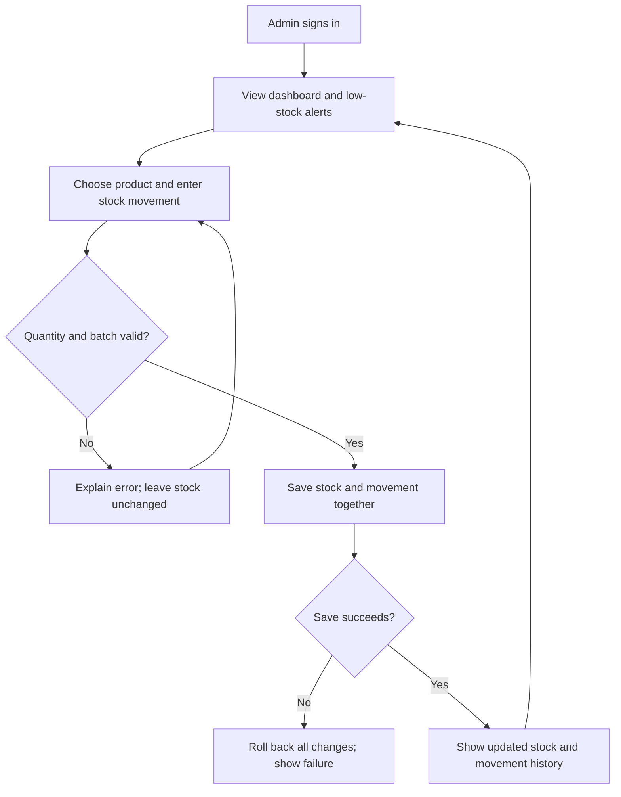

# Example Owner Handoff

This is an illustrative response for the [Warehouse Inventory PRD](app-prd-example.md),
not proof that an application has been built. A real handoff uses the conversation's
language and reports its actual validation results.

The specification describes a small inventory app for one warehouse admin.
It covers product management, inbound/outbound batch stock, low-stock alerts and
movement history. Entry is manual; barcode scanning and multi-user roles are
outside this example's selected scope.

The main stock-movement flow below comes directly from the saved PRD. Invalid
quantities leave stock unchanged; a failed save rolls back the whole stock change.
These behaviors map to FR-003, FR-004, NFR-002 and NFR-004; history and dashboard
outcomes map to FR-006 and FR-005.



In plain language: sign in, choose the product, enter the movement, correct any
validation errors, then save. Successful saves update stock and history together;
failed saves preserve the previous stock state.

The first runnable milestone is login, dashboard and product management with
persistent sample data. The following milestones connect stock movements and
history, then audit the full browser workflow. SQLite and a single admin are
selected assumptions; stack compatibility and application runtime remain UNVERIFIED.

To inspect this example's actual structural result:

```bash
node scripts/validate-prd.mjs examples/app-prd-example.md --json
node scripts/preview-prd.mjs examples/app-prd-example.md
```

When the target PRD is ready, open a fresh conversation in the target project,
attach PRD.md, and say: "Build this PRD until done. Verify the real user flow and
finish with IMPLEMENTATION_AUDIT.md." The document alone does not authorize a build.
