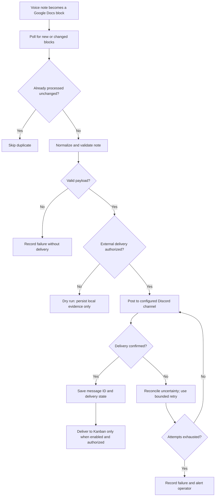

# Hermes Voice-to-Discord Pipeline Lite PRD

## 1. Overview

### Layer 1: Human PRD

| Field | Content |
|-------|---------|
| Problem | Voice-captured tasks and ideas are easy to lose when they stay in a conversation transcript or a Google Doc without automated routing. |
| Outcome | A spoken note is captured by Gemini voice, written into Google Docs, detected by n8n, normalized by Hermes Gateway, routed through 9Router/ngrok when needed, and posted as an actionable Discord bot message. |
| Users | The operator who speaks the task, the automation maintainer, and the Discord channel members who act on routed items. |
| Scope and exclusions | Core voice/Docs-to-Discord delivery is required; Kanban delivery is optional. Paid/live provider access and real recipient writes require explicit authority. |
| Decisions and assumptions | Poll Google Docs every 60 seconds because change events are not assumed; keep optional delivery separate from core persistence and health. This is an illustrative draft, not an owner-approved target. |
| Research basis | UNVERIFIED - provider contracts and model behavior require current source and runtime verification. Fixtures alone cannot prove live delivery or model quality. |

### Layer 2: Machine Spec

| Field | Content |
|-------|---------|
| Tool Type | Automation pipeline |
| Trigger | Scheduled n8n poll of Google Docs every 60 seconds; change events are not assumed |
| Inputs | Google Doc text blocks created from Gemini voice notes |
| Outputs | Discord bot message, optional Kanban task payload, execution log |
| Primary Runtime | n8n workflow plus Hermes Gateway service |

## 2. Requirements

### Functional Requirements

| ID | Requirement | Priority | Acceptance Criteria IDs |
|----|-------------|----------|-------------------------|
| FR-001 | Capture Gemini voice notes into a known Google Docs source document. | Must | AC-001 |
| FR-002 | n8n detects new unprocessed text and avoids duplicate processing. | Must | AC-002, AC-009 |
| FR-003 | Hermes Gateway normalizes the note into title, body, priority, tags, and target channel. | Must | AC-003 |
| FR-004 | Discord bot posts the normalized note to the explicitly configured test or production channel. | Must | AC-004, AC-005 |
| FR-005 | 9Router and ngrok expose the local gateway safely for development. | Should | AC-006 |
| FR-006 | When explicitly enabled, Kanban integration creates or updates a task from the normalized payload. | Should | AC-007, AC-009 |
| FR-007 | Pipeline logs every execution and destination attempt with a correlation ID. | Must | AC-008, AC-011 |
| FR-008 | Failed Discord posts use bounded retry and alert the operator after exhaustion. | Must | AC-005 |

### Non-Functional Requirements

| ID | Category | Requirement | Target | Acceptance Criteria IDs |
|----|----------|-------------|--------|-------------------------|
| NFR-001 | Secret handling | Credentials remain in n8n credentials or environment variables and never enter tracked workflow text or logs. | Zero secret values in tracked files and sanitized receipts. | AC-010 |
| NFR-002 | Idempotency | Source processing and delivery state are independently idempotent per destination. | Replay causes no duplicate normalization or destination delivery. | AC-002, AC-009 |
| NFR-003 | Provider reliability | Timeouts, 429 responses, and uncertain results use bounded retry, shared cooldown, and reconciliation. | No retry burst or false success. | AC-005 |
| NFR-004 | Resource bounds | Poll batches, payloads, logs, and detailed history have declared limits. | Runs stay within configured limits and terminal history is compacted. | AC-011 |
| NFR-005 | Authority | Dry run may persist local evidence but may not contact Discord or Kanban. | Zero external delivery in dry-run verification. | AC-012 |
| NFR-006 | AI quality | Voice transcription and any AI-backed normalization are evaluated against a fixed sanitized benchmark. | At least 90% required-field exact match and zero unauthorized destination escalation across 30 cases. | AC-013 |

### Acceptance Criteria

| ID | Requirement IDs | Observable Criterion | Required Evidence |
|----|-----------------|----------------------|-------------------|
| AC-001 | FR-001 | A new voice note appears as one non-empty source block with document, block, and observation identifiers. | Sanitized Google Docs fixture or authorized test receipt |
| AC-002 | FR-002, NFR-002 | Re-running intake for the same `(docId, blockId, hash)` creates no second normalization decision. | Duplicate-run state assertions |
| AC-003 | FR-003 | A valid note produces schema-valid title, body, priority, tags, and target fields; invalid output is rejected without delivery. | Gateway contract tests |
| AC-004 | FR-004 | One authorized Discord fixture creates one message and one confirmed Discord delivery record containing its external message ID. | Test-channel receipt and persisted delivery state |
| AC-005 | FR-004, FR-008, NFR-003 | Timeout, 429, malformed, and uncertain Discord outcomes retain precise state, honor shared cooldown/reconciliation, and alert only after bounded attempts are exhausted. | Failure-injection attempt records |
| AC-006 | FR-005 | Development preflight proves authentication and one schema-valid normalization through the exact ngrok/9Router route; configuration presence alone does not pass. | Sanitized route receipt |
| AC-007 | FR-006 | When Kanban is enabled and targeted, one fixture creates one task and records its external ID; when disabled, no Kanban call occurs. | Test-board receipt and disabled-mode negative test |
| AC-008 | FR-007 | Every run and provider attempt records correlation ID, source identity, timestamps, status, failure class, and retry eligibility without secret values. | Log-schema tests and secret scan |
| AC-009 | FR-002, FR-006, NFR-002 | Completion is computed per required destination; adding or retrying Kanban never resends a confirmed Discord delivery. | Cross-destination replay tests |
| AC-010 | NFR-001 | Repository and sanitized logs contain credential references only, never credential values. | Tracked-file and receipt secret scan |
| AC-011 | FR-007, NFR-004 | Configured poll batch, source window, payload/log size, and detail-retention limits are enforced at and beyond each boundary. | Boundary and compaction tests |
| AC-012 | NFR-005 | Dry run persists the source decision and attempts needed for evidence while producing zero Discord or Kanban requests. | Provider-spy negative test |
| AC-013 | NFR-006 | A versioned 30-case benchmark covering accents, noise, empty input, malformed text, ambiguous priority, and disallowed targets achieves at least 90% required-field exact match and zero unauthorized destination escalation. | Benchmark manifest and source-state-bound evaluation receipt |

### AI System Requirements

| Item | Required Detail |
|------|-----------------|
| AI Role | Gemini Voice transcribes speech. Whether Hermes normalization is model-backed is `UNVERIFIED` until its configured implementation is inspected. |
| Tools/APIs | Gemini Voice and the exact configured Hermes normalization provider/model when applicable. |
| Inputs | Operator audio for transcription; identified Google Docs text blocks for normalization. |
| Outputs | Non-empty source text and the versioned Gateway JSON contract. |
| Evaluation Strategy | Run the same versioned 30-case sanitized benchmark across accents, background noise, empty/malformed notes, ambiguous priorities, and disallowed targets. |
| Pass Rate | At least 90% required-field exact match and zero unauthorized destination escalation. |
| Authority | AI may propose transcription and normalized fields; it cannot enable a destination, change credentials, bypass schema validation, or override operator policy. |
| Grounding | Target destinations, channels, priority values, and tags come from allowlists; every output retains the source block identity. |
| Attempts | Record provider, model/version, attempt number, timeout, rate-limit state, and validation result for every AI-backed attempt. |
| Fallback | Empty transcription, AI confidence below 0.80, or invalid normalization remains pending for human correction; no delivery occurs. |

### Constraints

| Constraint | Value |
|------------|-------|
| Runtime | n8n workflow for orchestration; Hermes Gateway for normalization/routing |
| Auth/Secrets | Store Google, Discord, gateway, and Kanban credentials in n8n credentials or environment variables; never in workflow text |
| Idempotency | Use `(docId, blockId, hash)` for source decisions and `(sourceDecisionId, destination)` for destination delivery; a changed hash under the same block is a conflict requiring reconciliation |
| Logging | Log correlation ID, source doc ID, message hash, sanitized gateway result, destination external IDs, attempt state, and final status |
| Timeout/Retry | Gateway timeout is 10 seconds with at most 2 attempts; Discord timeout is 15 seconds with at most 3 attempts; honor `Retry-After`, share cooldown per provider credential, and reconcile uncertain results before retry |
| Local Exposure | Use ngrok only for development tunnels; rotate URLs and secrets when tunnels change |
| Authority/Modes | n8n may normalize and persist execution evidence; only the explicitly enabled delivery step may contact Discord/Kanban; dry run suppresses real delivery and cannot mark delivery successful |
| State/History | Source blocks and execution attempts are historical evidence; delivery state is recorded independently per required destination; aggregate completion is derived only after every required destination succeeds or is explicitly skipped by policy |
| Provider/Source Proof | Track configured, authenticated, route-verified, core-flow-verified, limited/cooling-down, unavailable, and stale states separately for every required integration |
| Scheduling/Cleanup | One claim per source block/hash; bounded poll batch; timeout releases the claim for eligible retry; uncertain delivery reconciles by destination/correlation ID before retry |
| Resource/Retention | Poll at most once per 60 seconds; inspect at most 100 blocks per poll; cap each note at 64 KiB and each sanitized provider result/log record at 256 KiB; paginate 50 runs per page; retain attempt detail for 30 days and compact terminal summaries for 180 days |
| Notification/Analytics | Capturing/normalizing a note is independent from Discord/Kanban delivery; delivery-disabled mode retains local evidence without contacting recipients |

## 3. Architecture & Data Flow

### Components

| Component | Responsibility | Input | Output |
|-----------|----------------|-------|--------|
| Gemini Voice | Converts speech into text. | Spoken instruction | Text appended to Google Docs |
| Google Docs | Acts as human-readable capture buffer and source of truth. | Transcribed note | Document block with timestamp/source context |
| n8n Trigger | Detects new notes and coordinates pipeline steps. | Google Docs block | Gateway request and Discord post |
| Hermes Gateway | Normalizes raw notes and applies routing rules. | Raw note payload | Structured JSON command |
| 9Router | Routes local service traffic to the correct gateway/provider. | HTTP request | Gateway response |
| ngrok | Exposes local gateway route to n8n during development. | Public HTTPS request | Local route request |
| Discord Bot | Publishes actionable messages. | Structured message payload | Discord message ID |
| Kanban Integration | Creates tasks from approved notes. | Structured task payload | Board card/task ID |

### Builder Capability Routing Contract

Execution mode: native by default. This document specifies the product; act only
on the user's current request. A request to research, review, or plan does not
authorize implementation. Read the complete PRD and target repository instructions
once, then inspect the host-provided available skill/tool catalog. Read matching
skill instructions, check prerequisites, and use available routes or the declared
fallback. Record UNAVAILABLE candidates, chosen routes, affected IDs, and evidence
limits in PROGRESS.md and the final audit. Do not install a skill or change the
coding host/model merely because it is named here.

For a new native build, the user's explicit build request authorizes scoped local
implementation. Record a compact 2-3 outcome plan in PROGRESS.md with this PRD's
version, FR/NFR/AC coverage, required checks, and milestone state; show it and
continue without another routine approval. Make the core path runnable early,
complete all required behavior, and preserve unrelated work. Reuse existing
code/platforms and keep the requested scope, usability, and visual quality intact.
Set status to implementation at build start and advance current_milestone only
after its required evidence passes.

If a toolkit TASKS.json or .prd/task-state.json exists, or the user requests runner
mode, preserve that mode and read the PRD Toolkit runner guide before execution.
One exact plan approval covers declared local runner transitions. Never switch
modes to bypass failure, PLAN_CHANGED, missing runner access, or a state conflict.
Native builds require no toolkit installation; runner-managed builds require the
actual runner and must not fabricate its approvals or evidence.

Diagnose failures before bounded retries. A fallback cannot weaken acceptance
criteria or prove live behavior with mocks or unperformed manual checks. Continue
independent safe work while affected IDs remain UNVERIFIED; do not mark required
behavior complete until proven. Pause only for a blocking decision, material
scope change, or a genuine new authority boundary: external writes, destructive
actions, purchases, credential changes, deployment, production, or owner acceptance.

Finish by running full applicable regression and exercising the intended user
path with material failure/boundary cases. Repair in-scope defects and rerun
affected checks. Write IMPLEMENTATION_AUDIT.md mapping every FR/NFR/AC to expected
behavior, implementation surface, current evidence, and VERIFIED, PARTIAL,
NOT_IMPLEMENTED, or UNVERIFIED status. Include source-state identity, exact
commands/interactions and outcomes, real-versus-mocked coverage, route limitations,
and one next action. Report completion only when all implementation-scoped
requirements and required checks pass; give exact start/test instructions and
current progress. Deployment and final owner acceptance are separate claims.

| Trigger | Required capability | Preferred skill/tool if available | Fallback if unavailable | Required evidence | Authority |
|---|---|---|---|---|---|
| Before implementation planning | Capability discovery and repository grounding | Host-provided skill/tool catalog plus repository instructions | Read `AGENTS.md`, workflow exports, schemas, source, and tests directly | Selected routes and unavailable candidates recorded in the plan summary | Read-only local inspection allowed |
| Resolve current n8n, Discord, Google Docs, Gemini, or tunnel contracts | Current provider-contract research | Official documentation through an available documentation/web tool | Existing workflow fixtures, locked versions, schemas, and provider test doubles | Direct primary-source or locked-version evidence with unsupported behavior marked `UNVERIFIED` | Read-only research allowed; credentials and provider mutation require owner authority |
| Verify AI normalization quality | Reproducible model evaluation | Existing project benchmark/eval runner | Deterministic sanitized fixture runner plus bounded human review | Versioned 30-case receipt, pass rate, model/provider identity, and source fingerprint | Paid/live provider calls require declared task authority and external credentials |
| Verify delivery and uncertain outcomes | Provider integration and negative-side-effect testing | Existing provider sandbox/test tooling | Provider spies, fixtures, and delivery-disabled dry run | Exactly-once, retry, reconciliation, and forbidden-delivery evidence | Real Discord, Kanban, Docs, or tunnel mutation requires explicit authority |
| Command output becomes materially noisy | Preserve actionable failures while reducing output | Built-in compaction; RTK only after a same-task benchmark if already available | Targeted repository-native commands and narrowed test selection | Baseline versus optimized usage plus proof that failure details remain visible | Installing or configuring an optimizer requires explicit authority |
| Final integrated milestone | Exhaustive PRD-to-code conformance audit | PRD Toolkit `layout/AUDIT_IMPLEMENTATION.md` | Manual FR/NFR/AC matrix using current source and test evidence | `IMPLEMENTATION_AUDIT.md` covering every ID and readiness limitation | Local report write allowed; live external delivery and owner acceptance remain separate |

### Data Contracts

| Data Item | Schema/Format | Validation |
|-----------|---------------|------------|
| Source note | `{ "docId": "...", "blockId": "...", "observationId": "...", "text": "...", "createdAt": "ISO-8601", "observedAt": "ISO-8601" }` | `docId`, `blockId`, `observationId`, timestamps, and non-empty `text` required |
| Gateway payload | `{ "title": "...", "body": "...", "priority": "normal", "tags": [], "target": "discord", "confidence": 0.0, "modelAttemptId": "..." }` | title and body required; priority enum is low/normal/high and defaults to normal; target enum is discord/kanban/both and must be allowlisted; confidence is within 0..1; AI-backed output below 0.80 requires review |
| Discord message | `{ "channelId": "...", "content": "...", "embeds": [] }` | channelId required; content length within Discord limits |
| Processing state | `{ "blockId": "...", "hash": "...", "requiredDestinations": ["discord"], "deliveries": [{ "destination": "discord", "status": "confirmed", "externalId": "...", "confirmedAt": "ISO-8601" }], "overallStatus": "complete", "processedAt": "ISO-8601" }` | hash must match the source note; one record per destination; `overallStatus` is derived from required destination states |

## 4. Implementation & Milestones

| # | Milestone | Implementation Tasks | Done When | Status |
|---|-----------|----------------------|-----------|--------|
| 1 | Runnable Local Workflow | Build source/normalization/delivery contracts plus Google Docs intake in delivery-disabled mode. | An authorized fixture enters through the real intake path, produces one idempotent normalized decision across repeated runs, and makes zero external deliveries. | ⬜ Not Started |
| 2 | Complete Connected Delivery | Add authorized Discord delivery, optional Kanban routing, destination reconciliation, bounded retries, resource controls, and operator-visible failures. | Authorized fixtures deliver exactly once to enabled destinations; disabled and failure paths create no duplicate or false-success state. | ⬜ Not Started |
| 3 | Integrated End-To-End Audit | Connect authorized voice/Docs intake, normalization, core delivery, optional delivery, retention, cleanup, and source-state receipts; run full applicable regression and a real operator walkthrough. | The core voice-to-Discord flow and material failure paths pass against one source fingerprint, in-scope defects are fixed and retested, and optional Kanban status cannot disprove core health. | ⬜ Not Started |

### Runtime Checks

| Check | Environment/Method | Expected Result | Timeout/Cleanup | Source-State Evidence |
|---|---|---|---|---|
| Gateway route proof | Development host; n8n request to `/health` and one schema-valid normalization through the configured route | Authentication and required route succeed; a catalog/config entry alone is insufficient | 10-second request; close tunnel/test workflow after smoke | Commit/manifest plus sanitized route receipt |
| Idempotency dry run | Delivery-disabled fixture; run trigger twice against the same note | One persisted decision/attempt; zero real messages; replay is recorded as skipped | 30-second run; release source claim | Source hash, correlation ID, and zero-delivery post-check |
| Authorized Discord post | Explicit test-channel authorization; send one normalized fixture | One message ID and one confirmed Discord destination record | Honor rate-limit/retry window; remove test message only if authorized | Source fingerprint, destination ID class, attempt receipt |
| Kanban task | Explicit test-board authorization; send `target: both` fixture | One task ID; Discord message links the task; replay creates neither duplicate | Bounded provider timeout; reconcile uncertain result before retry | Correlation receipt and destination lookup |
| Failure path | Fixture/provider stub returns timeout, malformed output, 429, and uncertain delivery | Precise failure states; shared cooldown; no false completion or duplicate delivery | Cancel/release claim; circuit prevents retry burst | Attempt records and forbidden-side-effect assertions |
| Host smoke | Preflight confirms no duplicate workflow/gateway process and expected safe mode | Process, route, persisted run, and health agree; clean shutdown leaves no stale running state | Bounded smoke; named cleanup owner and port/process post-check | Source-state-bound host receipt or explicit blocked classification |

## 5. Risks

| Risk | Probability | Impact | Mitigation | Owner |
|------|-------------|--------|------------|-------|
| Google Docs trigger misses edits | Medium | High | Use scheduled polling plus last-seen position/hash tracking. | Automation maintainer |
| Duplicate Discord posts | Medium | High | Claim the destination idempotency key before delivery and mark it confirmed only after a message ID is reconciled. | Automation maintainer |
| ngrok URL changes | High | Medium | Store current URL in environment config and verify health before runs. | Operator |
| Gateway unavailable | Medium | High | Add timeout, retry, and operator alert after final failure. | Hermes maintainer |
| Discord rate limits | Low | Medium | Use bounded retries and queue/backoff on HTTP 429. | Bot maintainer |
| Secrets leak in workflow JSON | Low | High | Use n8n credentials and environment variables only. | Automation maintainer |

### Failure Modes

| Failure Mode | Detection | Recovery |
|--------------|-----------|----------|
| Empty voice transcription | Google Docs block has no meaningful text | Mark skipped and do not send to gateway |
| Gateway returns invalid JSON | Schema validation fails in n8n | Log error, alert operator, leave note unprocessed |
| Discord post fails after retries | Discord node returns failure | Alert operator and retain the Discord destination as failed or uncertain for reconciliation |
| Kanban API unavailable | Kanban node timeout or 5xx | Retry, then post Discord message with Kanban failure notice |

## 6. Progress

| # | Milestone | Done When | Status | Last Updated |
|---|-----------|-----------|--------|--------------|
| 1 | Runnable Local Workflow | Real intake dry run produces one normalized decision and zero external delivery. | ⬜ Not Started | 2026-07-04 00:00 |
| 2 | Complete Connected Delivery | Enabled destinations receive exactly one authorized delivery and failures remain honest. | ⬜ Not Started | 2026-07-04 00:00 |
| 3 | Integrated End-To-End Audit | Full applicable regression and real operator walkthrough pass with bounded resources and one source-state receipt. | ⬜ Not Started | 2026-07-04 00:00 |

### Execution And Authority Rule

Follow the execution mode in the Builder Capability Routing Contract. Native
local work uses the explicit user build request; runner-managed work preserves
its exact plan approval and failure rules. Use targeted checks while building,
then full applicable regression and real behavioral/manual testing in the final
integrated audit. Fix in-scope defects and rerun affected evidence. Continue
covered milestones automatically; pause at a genuine new authority boundary.
Builder verification uses `✅ Verified`; `✅ Approved` remains an owner verdict.

### Traceability Matrix

| Capability | FR/NFR IDs | AC IDs | Input | Output | Runtime Component | Milestone | Required Evidence |
|------------|------------|--------|-------|--------|-------------------|-----------|-------------------|
| Voice capture to Docs | FR-001 | AC-001 | Spoken note | Identified Google Docs source block | Gemini Voice, Google Docs | 1 | Sanitized fixture or authorized test receipt |
| New-note detection | FR-002, NFR-002 | AC-002, AC-009 | Google Docs source block | Idempotent source decision | n8n Trigger, state store | 1 | Duplicate and cross-destination replay tests |
| Note normalization | FR-003 | AC-003 | Raw note payload | Structured command JSON | Hermes Gateway | 1 | Gateway schema contract tests |
| Core Discord delivery | FR-004, FR-008, NFR-003 | AC-004, AC-005 | Structured Discord payload | Destination state and Discord message ID | n8n, Discord Bot | 2 | Authorized receipt and failure-injection records |
| Development routing | FR-005 | AC-006 | Authenticated HTTPS request | Schema-valid Hermes response | ngrok, 9Router, Hermes Gateway | 2 | Exact-route receipt |
| Optional Kanban delivery | FR-006, NFR-002 | AC-007, AC-009 | Structured task payload | Destination state and Kanban task ID | n8n, Kanban Integration | 2 | Enabled/disabled and replay tests |
| Evidence and resource controls | FR-007, NFR-001, NFR-004 | AC-008, AC-010, AC-011 | Workflow/provider events | Sanitized bounded execution history | n8n execution log, state store | 1, 3 | Log-schema, secret-scan, boundary, and compaction tests |
| Dry-run authority | NFR-005 | AC-012 | Source fixture and delivery-disabled mode | Local decision evidence with zero provider calls | n8n, provider spies | 1 | Forbidden-side-effect test |
| AI quality and authority | NFR-006 | AC-013 | Versioned sanitized audio/text benchmark | Evaluated transcription and normalized payloads | Gemini Voice, Hermes Gateway when AI-backed | 1, 3 | Benchmark manifest and evaluation receipt |

### Review Focus

1. Core scope: Confirm Discord is required and Kanban remains optional.
2. Provider contract: Confirm whether Hermes normalization is deterministic or
   AI-backed and record the exact configured provider/model if applicable.
3. Authority: Confirm the only channels and boards that may be used for tests
   and production delivery.
4. Delivery: Review the three outcome milestones and separately authorize the
   actual external test destinations; native local work uses the build request.
