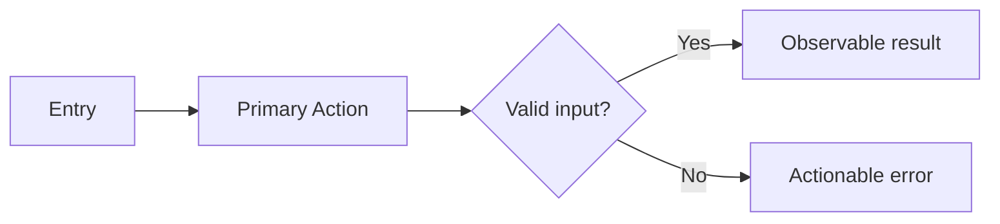
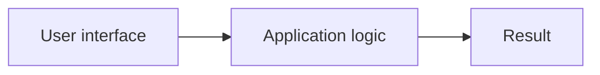

# [Project Name] PRD

<!--
Use this Full template for apps, dashboards, SaaS products, marketplaces, portals,
or full-stack systems where UI, data models, APIs, and implementation file maps matter.
Replace every bracketed placeholder. Human intent and machine contracts need
one canonical definition each; reference IDs/headings elsewhere. Sample rows
and diagrams are not required infrastructure. Remove unused rows and use one
specific N/A explanation for genuinely absent capabilities.
Use Mermaid for diagrams. Do not leave TBD/TODO text in a finished PRD.
-->

## 1. Overview

<!-- Explain why this project exists and what success looks like. -->

### Layer 1: Human PRD

| Field | Content |
|-------|---------|
| Problem Statement | [Who has the pain, what breaks today, and what measurable cost it creates.] |
| Proposed Solution | [What will be built, how users benefit, and why this approach is appropriate.] |
| Target Users | [Primary persona, secondary persona, scale, permissions, and technical level.] |
| Scope and exclusions | [Selected outcome, MVP boundary, and explicit exclusions; link to later detail within this PRD.] |
| Decisions and assumptions | [Resolved choices with rationale; distinguish owner decisions from proposed defaults and blocking open questions.] |
| Research basis | [Build-relevant conclusions with source/date and remaining UNVERIFIED claims, or N/A - no external research required.] |

### Goals & Success Metrics

| Goal | Metric | Target Value | Measurement Method |
|------|--------|--------------|--------------------|
| [Goal 1] | [Metric] | [Target] | [How measured] |

<!-- Add only distinct goals the product actually needs. -->

### Layer 2: Machine Spec

| Constraint | Value |
|------------|-------|
| Product Type | [app/dashboard/full-stack system] |
| Primary Platform | [web/mobile/desktop/PWA] |
| Deployment Target | [Vercel/Railway/VPS/Docker/etc.] |
| Data Sensitivity | [public/internal/private/regulated] |

## 2. Requirements

<!-- For existing-product changes or bugs, embed the Change Contract here or
in Overview. Read docs/CHANGE_CONTRACT.md while generating, then copy the actual
current evidence, requested change, preserved behavior/interfaces/data, affected
IDs and ID | Status | Note table, changed/preserved verification, and original
bug reproducer into the PRD. Keep continuing IDs and retirement history. The
finished PRD must not require access to this toolkit or the prior conversation. -->

### Review Focus

[Material unresolved owner decision, or N/A - no unresolved owner decision.]

<!-- Requirements must be testable. Use stable FR/NFR/AC IDs. Priority follows product need; do not force an arbitrary percentage split. -->

### Functional Requirements

| ID | Requirement | Priority | Rationale | Acceptance Criteria IDs |
|---|---|---|---|---|
| FR-001 | [Requirement] | Must | [Why required] | AC-001, AC-002 |
| FR-002 | [Requirement] | Must | [Why required] | AC-003 |
| FR-003 | [Requirement] | Should | [Why important] | AC-004 |
| FR-004 | [Requirement] | Nice | [Why useful] | AC-005 |

### Non-Functional Requirements

| ID | Category | Requirement | Target | Acceptance Criteria IDs |
|---|---|---|---|---|
| NFR-001 | Performance | [Page/API target] | [Example: p95 API < 500 ms] | AC-006 |
| NFR-002 | Security | [Auth/secrets/access control] | [Target] | AC-007 |
| NFR-003 | Reliability | [Retries/backups/idempotency] | [Target] | AC-008 |
| NFR-004 | Accessibility | [WCAG/browser/device target] | [Target] | AC-009 |

### Conditional Reliability Contracts

<!--
Include only applicable contracts. Reference existing NFR/AC definitions rather
than repeating them. Group unused controls under a specific N/A reason; do not
infer providers, schedulers, sessions, or analytics merely to fill this table.
-->

| Contract | Required Detail | Acceptance Evidence or N/A |
|---|---|---|
| [Applicable contract] | [Rule or existing requirement/contract reference] | [AC/test reference] |

## 3. Core Features

<!-- Each feature needs purpose, acceptance criteria, failure behavior, and traceability hooks. -->

### Feature 1: [Feature Name]

[Describe the user outcome; reference the governing FR/NFR IDs rather than
repeating the Requirements section.]

| Item | Specification |
|------|---------------|
| Inputs | [Forms, files, API payloads, voice, etc.] |
| Outputs | [Screens, records, notifications, exports, etc.] |
| Data Dependencies | [Tables/entities/services] |
| UI Components | [Pages/components/states] |
| Failure Handling | [Validation, retry, timeout, empty state] |

**Acceptance Criteria**

| ID | Requirement IDs | Type | Observable criterion | Required evidence |
|---|---|---|---|---|
| AC-001 | FR-001 | Positive | [Measurable success criterion] | [Test/receipt] |
| AC-002 | FR-001 | Negative | [Forbidden or failure behavior] | [Negative test/receipt] |
| AC-006 | FR-001, NFR-001 | Boundary | [Boundary or performance criterion] | [Measurement/receipt] |

## 4. User Flow

<!-- Describe happy/failure paths once. Reference the Architecture diagram if
it already covers this flow; add a separate Mermaid only for distinct behavior. -->
<!-- This product flow is also reused verbatim in the owner's final summary.
Use plain labels, actual actors/results, and material failure/recovery branches. -->

### Primary Flow



### Interaction Detail

<!-- Include only behavior not already clear from the flow or ACs. -->

| Step | Actor | Action | System Response |
|------|-------|--------|-----------------|
| 1 | [User] | [Action] | [Response] |
| 2 | [System] | [Action] | [Response] |

### Edge Cases

| Edge Case | Handling | User Feedback |
|-----------|----------|---------------|
| [Material edge case or AC reference] | [Handling rule] | [User feedback] |

## 5. Architecture

<!-- Include the major runtime boundaries and external dependencies. -->

### System Diagram

<!-- Replace with actual boundaries. No database, auth, API, or cloud is presumed. -->


### Tech Stack

| Layer | Technology | Version | Rationale | Verification |
|-------|------------|---------|-----------|--------------|
| [Actual runtime/component] | [Selected technology] | [Version] | [Reason] | [Source/date or UNVERIFIED] |

<!-- Include required inputs, runtime prerequisites, credential variable names,
and the safe local start/verification procedure here or in Milestones. Label
proposed commands and unobserved behavior UNVERIFIED. The builder must not need
the original conversation to recover a material decision or contract. -->

### Builder Capability Routing Contract

Act on the current request: a PRD alone does not authorize building. At startup,
read this PRD and target instructions once; inspect the host-provided available
skill/tool catalog, read matching instructions, and check prerequisites.
Record chosen routes, UNAVAILABLE preferences, affected IDs, and evidence limits
in PROGRESS.md and the audit. Names do not authorize installation or host/model
changes; use declared repository-native fallbacks.

For new native builds, the explicit build request authorizes scoped local work.
Use this PRD's outcome milestones and coverage in PROGRESS.md; show the plan and
continue without another routine approval. Make the core path runnable early,
complete the requested scope and visual quality, and preserve unrelated work.
Set status to implementation at build start; advance current_milestone only
after required evidence passes. Component steps stay internal checklists.

Existing toolkit TASKS.json/.prd/task-state.json or an explicit runner request
requires the actual runner and its guide. Preserve exact plan approval and
failure rules; never bypass failure, PLAN_CHANGED, missing runner access, or
state conflicts by switching modes. Native builds need no toolkit installation.

Read relevant changed files on continuation, not the whole project per step.
Keep a concise resume delta in PROGRESS.md: current milestone, changed paths,
checks/results, unresolved IDs, and next action. Recheck affected dependencies
when source, requirements, environment, or route evidence changes. Do not repeat
unchanged discovery, regenerate the PRD, or rerun unrelated suites per file.

Use targeted checks while building; diagnose failures before bounded retries.
Fallbacks never weaken ACs or turn mocks/unperformed manual checks into live
proof. Continue independent safe work, keeping dependent IDs UNVERIFIED.
Pause for blocking decisions, material scope changes, or a genuine new authority boundary: external
writes, destructive actions, purchases, credentials, deployment, production,
or owner acceptance—not ordinary milestone transitions.

Finish with full applicable regression, the intended user path and material
failure/boundary tests; repair in-scope defects and rerun affected checks.
IMPLEMENTATION_AUDIT.md must cover every FR/NFR/AC: expected behavior, surface,
source-state identity, exact checks/results, real-versus-mocked evidence,
VERIFIED/PARTIAL/NOT_IMPLEMENTED/UNVERIFIED status, and limitations.
Completion requires all implementation-scoped requirements/checks to pass.
After each milestone report outcome, grouped changes, exact trial instructions,
verification, limits, progress, and next action; continue covered work automatically.
Deployment and final owner acceptance are separate claims.

| Trigger | Required capability | Preferred skill/tool if available | Fallback if unavailable | Required evidence | Authority |
|---|---|---|---|---|---|
| [Implementation or verification trigger] | [Capability needed] | [Exact available skill/tool or conditional candidate] | [Repository-native/manual fallback] | [Test, receipt, screenshot, runtime observation, or UNVERIFIED rule] | [Local allowed action or explicit owner boundary] |

<!-- Add a sequence diagram only for ordering/concurrency not clear above. -->

## 6. Data Models

<!-- Every feature must map to at least one data model, external payload, or explicit N/A reason. -->

<!-- Use a model table for simple structures; add an ERD only for meaningful
relationships. Do not create users/auth tables without a product requirement. -->

### Model Table

| Model | Purpose | Key Fields | Relationships | Indexes |
|-------|---------|------------|---------------|---------|
| [Model] | [Purpose] | [Fields] | [Relations] | [Indexes] |

### Validation Rules

| Field/Input | Type | Rule | Error Message |
|-------------|------|------|---------------|
| [Field] | [Type] | [Rule] | [Message] |

## 7. Design System

<!-- Preserve requested visual quality. Define typography, spacing, accessibility,
responsive/platform behavior and performance, or reference an existing design
system precisely. Tokens below are examples, not a requirement for dual themes. -->

### Visual Tokens

| Token | Light Mode | Dark Mode | CSS Variable |
|-------|------------|-----------|--------------|
| Primary | [#000000] | [#FFFFFF] | --color-primary |
| Background | [#FFFFFF] | [#000000] | --color-bg |
| Surface | [#FFFFFF] | [#111111] | --color-surface |
| Text | [#111111] | [#F8F8F8] | --color-text |
| Danger | [#DC2626] | [#FCA5A5] | --color-danger |

### Interaction States

| State | Requirement |
|-------|-------------|
| Loading | [Skeleton/spinner rules] |
| Empty | [Empty state copy and CTA] |
| Error | [Inline/toast/page-level behavior] |
| Disabled | [Visual and keyboard behavior] |

## 8. API Spec

<!-- If no API exists, state why and document command/input contracts instead. -->

### Endpoint Table

| Method | Path | Purpose | Auth | Request | Success | Error |
|--------|------|---------|------|---------|---------|-------|
| GET | /api/[resource] | [Purpose] | [Yes/No] | [Schema] | [Schema] | [Schema] |
| POST | /api/[resource] | [Purpose] | [Yes/No] | [Schema] | [Schema] | [Schema] |

### Error Format

```json
{
  "success": false,
  "error": {
    "code": "VALIDATION_ERROR",
    "message": "Human-readable message",
    "details": [
      { "field": "field_name", "issue": "Specific issue" }
    ]
  }
}
```

## 9. File Map

<!-- Map actual implementation boundaries, not an exhaustive list of imagined
files. Use the responsibility table; add a tree only if nesting needs explanation. -->


| Path | Purpose | Owner/Layer |
|------|---------|-------------|
| [path] | [Purpose] | [Frontend/Backend/Data/etc.] |

## 10. Milestones

<!-- Use 2-3 milestone tasks by default including final integrated audit; 4 requires independently meaningful outcomes and 5 is an exceptional hard ceiling. The first implementation milestone should make the product runnable or visibly testable when dependencies permit. Phase/layer changes are not approval gates. -->

| # | Milestone | Done When | Status |
|---|-----------|-----------|--------|
| 1 | [Milestone name] | [Concrete verification criteria] | ⬜ Not Started |
| 2 | [Milestone name] | [Concrete verification criteria] | ⬜ Not Started |
| 3 | [Milestone name] | [Concrete verification criteria] | ⬜ Not Started |

Live state/evidence belongs in PROGRESS.md, referencing the milestone numbers
above. Keep PRD status metadata synchronized. Follow the embedded builder
contract for continuation and verification; do not duplicate its procedure.

### Authority Policy v1

For a new native build, the user's explicit build request authorizes scoped local implementation.

One exact plan approval covers declared local runner transitions.

Pause only for a blocking decision, material scope change, or a genuine new authority boundary: external writes, destructive actions, purchases, credential changes, deployment, production, or owner acceptance.

### Traceability Matrix

<!-- Coverage is two-way: every feature and applicable requirement/acceptance criterion must appear, with no orphan FR/NFR/AC IDs. -->

| Feature | FR/NFR IDs | AC IDs | Data Model(s) | API/Interface | UI/File Path | Milestone | Required Evidence |
|---|---|---|---|---|---|---|---|
| [Feature] | FR-001, NFR-001 | AC-001, AC-002, AC-006 | [Model] | [Endpoint/command] | [Path] | 1 | [Test/receipt] |

### Verification Receipt and Operator Handoff

| Field | Required Value |
|---|---|
| Proven claim/status | [Implemented/unit verified/integration verified/deployed/running/exercised/accepted] |
| Source state | [Commit or secret-free manifest fingerprint] |
| Environment | [Working directory, runtime/interpreter, permissions, dependency access] |
| Procedure and result | [Sanitized command/method, time, exit/result, key assertions] |
| Side effects and cleanup | [Expected/forbidden observed effects, shutdown/cleanup, post-check] |
| Readiness and limitations | [Exact proven behavior, real versus mocked coverage, remaining uncertainty] |
| One next action | [Exactly one action or `No action - wait for [gate]`] |
