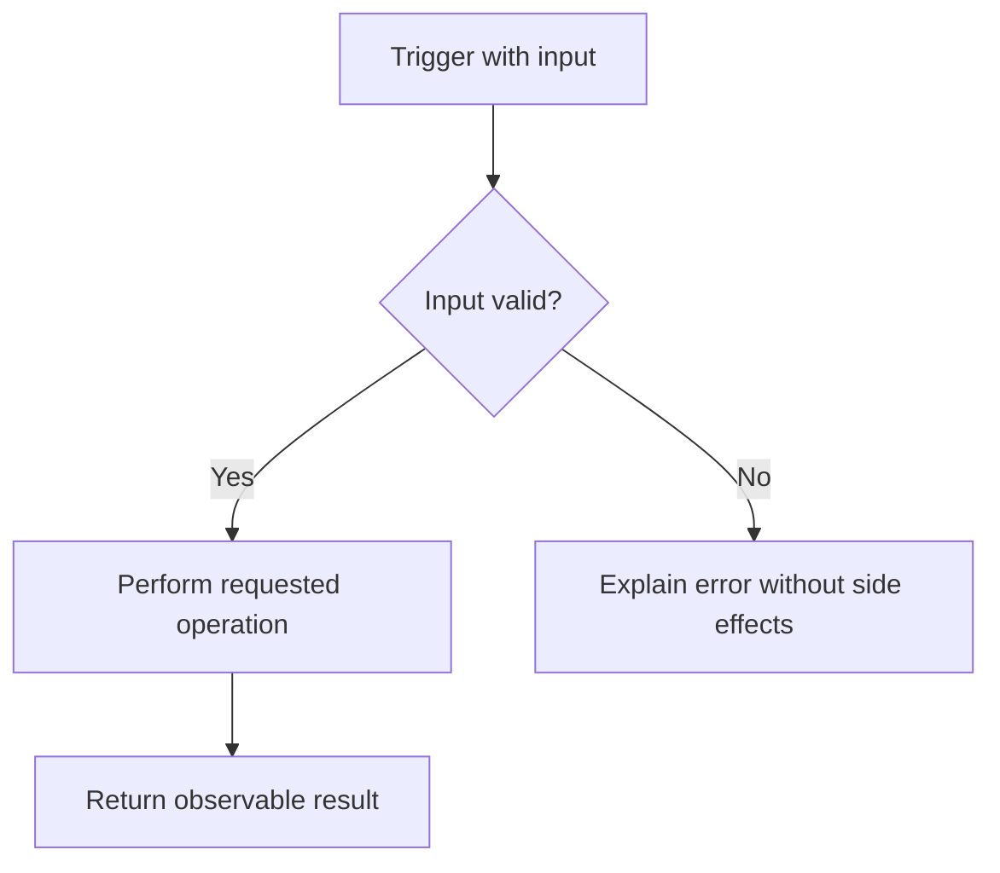

# [Tool or Automation Name] Lite PRD

<!--
Use this Lite template for tools, CLIs, automations, bots, scripts, data pipelines,
agent workflows, and integrations. Keep it compact, but still implementation-ready.
Use Two-Layer Design: Layer 1 = human/user outcome, Layer 2 = machine/runtime contract.
Do not add app-only sections unless the tool truly has a user-facing UI.
-->

## 1. Overview

### Layer 1: Human PRD

| Field | Content |
|-------|---------|
| Problem | [Who needs this and what manual process or failure it replaces.] |
| Outcome | [What done looks like from the user's perspective.] |
| Users | [Operator, developer, team, or downstream consumer.] |
| Scope and exclusions | [Selected outcome, MVP boundary, and explicit exclusions.] |
| Decisions and assumptions | [Resolved choices with rationale; distinguish owner decisions from proposed defaults and blocking open questions.] |
| Research basis | [Build-relevant conclusions with source/date and remaining UNVERIFIED claims, or N/A - no external research required.] |

### Layer 2: Machine Spec

| Field | Content |
|-------|---------|
| Tool Type | [CLI/automation/bot/pipeline/integration] |
| Trigger | [Manual command, webhook, schedule, file change, chat event, etc.] |
| Inputs | [Input sources and schemas] |
| Outputs | [Files, API calls, messages, records, notifications] |

## 2. Requirements

### Review Focus

[Material unresolved owner decision, or N/A - no unresolved owner decision.]

<!-- Keep requirements observable. Include failure behavior and operational constraints. -->

| ID | Requirement | Priority | Acceptance Criteria IDs |
|---|---|---|---|
| FR-001 | [Functional requirement] | Must | AC-001, AC-002 |
| FR-002 | [Functional requirement] | Should | AC-003 |
| NFR-001 | [Reliability/security/performance requirement] | Must | AC-004 |
| NFR-002 | [Operational requirement] | Should | AC-005 |

### Acceptance Criteria

| ID | Requirement IDs | Type | Observable criterion | Required evidence |
|---|---|---|---|---|
| AC-001 | FR-001 | Positive | [Expected successful behavior] | [Test/receipt] |
| AC-002 | FR-001 | Negative | [Expected failure or forbidden behavior] | [Negative test/receipt] |
| AC-004 | NFR-001 | Boundary | [Measurable limit or invariant] | [Measurement/receipt] |

### Constraints

| Constraint | Value |
|------------|-------|
| [Applicable runtime/security/state/resource constraint] | [Concrete value or NFR/contract reference] |

<!-- Cover actual secrets, logging, retries, idempotency, provider/state and resource
risks. Remove unused categories with a grouped specific N/A reason. -->

## 3. Architecture & Data Flow

<!-- Show the actual product flow in plain labels, including material failure
and recovery paths. Reuse this flowchart verbatim in the owner's final summary. -->

### Components

| Component | Responsibility | Input | Output |
|-----------|----------------|-------|--------|
| [Component] | [Responsibility] | [Input] | [Output] |

### Builder Capability Routing Contract

Act on the current request: a PRD alone does not authorize building. At startup,
read this PRD and target instructions once; inspect the host-provided available
skill/tool catalog, read matching instructions, and check prerequisites.
Record chosen routes, UNAVAILABLE preferences, affected IDs, and evidence limits
in PROGRESS.md and the audit. Names do not authorize installation or host/model
changes; use declared repository-native fallbacks.

For new native builds, the explicit build request authorizes scoped local work.
Use this PRD's outcome milestones and coverage in PROGRESS.md; show the plan and
continue without another routine approval. Make the core path runnable early,
complete the requested scope and visual quality, and preserve unrelated work.
Set status to implementation at build start; advance current_milestone only
after required evidence passes. Component steps stay internal checklists.

Existing toolkit TASKS.json/.prd/task-state.json or an explicit runner request
requires the actual runner and its guide. Preserve exact plan approval and
failure rules; never bypass failure, PLAN_CHANGED, missing runner access, or
state conflicts by switching modes. Native builds need no toolkit installation.

Read relevant changed files on continuation, not the whole project per step.
Keep a concise resume delta in PROGRESS.md: current milestone, changed paths,
checks/results, unresolved IDs, and next action. Recheck affected dependencies
when source, requirements, environment, or route evidence changes. Do not repeat
unchanged discovery, regenerate the PRD, or rerun unrelated suites per file.

Use targeted checks while building; diagnose failures before bounded retries.
Fallbacks never weaken ACs or turn mocks/unperformed manual checks into live
proof. Continue independent safe work, keeping dependent IDs UNVERIFIED.
Pause for blocking decisions, material scope changes, or a genuine new authority boundary: external
writes, destructive actions, purchases, credentials, deployment, production,
or owner acceptance—not ordinary milestone transitions.

Finish with full applicable regression, the intended user path and material
failure/boundary tests; repair in-scope defects and rerun affected checks.
IMPLEMENTATION_AUDIT.md must cover every FR/NFR/AC: expected behavior, surface,
source-state identity, exact checks/results, real-versus-mocked evidence,
VERIFIED/PARTIAL/NOT_IMPLEMENTED/UNVERIFIED status, and limitations.
Completion requires all implementation-scoped requirements/checks to pass.
After each milestone report outcome, grouped changes, exact trial instructions,
verification, limits, progress, and next action; continue covered work automatically.
Deployment and final owner acceptance are separate claims.

| Trigger | Required capability | Preferred skill/tool if available | Fallback if unavailable | Required evidence | Authority |
|---|---|---|---|---|---|
| [Implementation or verification trigger] | [Capability needed] | [Exact available skill/tool or conditional candidate] | [Repository-native/manual fallback] | [Test, receipt, runtime observation, or UNVERIFIED rule] | [Local allowed action or explicit owner boundary] |

### Data Contracts

| Data Item | Schema/Format | Validation |
|-----------|---------------|------------|
| [Item] | [JSON/text/file/etc.] | [Rule] |

## 4. Implementation & Milestones

<!-- Use 2-3 milestone tasks by default including final integrated audit; 4 requires independently meaningful outcomes and 5 is an exceptional hard ceiling. Make the tool runnable as early as dependencies permit. Phase/layer changes are not approval gates. -->

| # | Milestone | Implementation Tasks | Done When | Status |
|---|-----------|----------------------|-----------|--------|
| 1 | [Milestone] | [Tasks] | [Concrete proof] | ⬜ Not Started |
| 2 | [Milestone] | [Tasks] | [Concrete proof] | ⬜ Not Started |
| 3 | [Milestone] | [Tasks] | [Concrete proof] | ⬜ Not Started |

### Runtime Checks

<!-- Specify required inputs, runtime prerequisites, credential variable names,
and the safe local start/verification procedure. Label proposed commands and
unobserved behavior UNVERIFIED; do not rely on the original conversation. -->

| Check | Environment/Method | Expected Result | Timeout/Cleanup | Source-State Evidence |
|-------|--------------------|-----------------|-----------------|-----------------------|
| Syntax/config | [Working directory, runtime, command] | [Expected] | [Timeout and cleanup] | [Fingerprint/receipt] |
| Dry run | [Safe mode and command] | [Expected and forbidden side effects] | [Timeout and cleanup] | [Fingerprint/receipt] |
| Failure path | [Scenario] | [Precise failure and recovery] | [Timeout, cancellation, post-check] | [Fingerprint/receipt] |
| Host smoke | [Preflight, process/port/session checks] | [Running/exercised state] | [Bounded duration and shutdown owner] | [Receipt or N/A reason] |

## 5. Risks

| Risk | Probability | Impact | Mitigation | Owner |
|------|-------------|--------|------------|-------|
| [Risk] | [Low/Med/High] | [Low/Med/High] | [Mitigation] | [Owner] |

### Failure Modes

| Failure Mode | Detection | Recovery |
|--------------|-----------|----------|
| [Failure] | [Signal/log/error] | [Retry/fallback/manual action] |

## 6. Progress

Milestone outcomes and Done When are defined in section 4; do not duplicate that
table here. Live state/evidence is in PROGRESS.md. Keep the section 4 status and
PRD frontmatter synchronized with verified progress. Statuses are ⬜ Not Started,
🔄 In Progress, ✅ Verified, and ✅ Approved; Approved requires an owner verdict.
Follow the embedded builder contract for automatic continuation, summaries, and
integrated audit. Required gaps remain UNVERIFIED, not silently removed.

### Traceability Matrix

<!-- Coverage is two-way: every capability and applicable requirement/acceptance criterion must appear, with no orphan FR/NFR/AC IDs. -->

| Capability | FR/NFR IDs | AC IDs | Input | Output | Runtime Component | Milestone | Required Evidence |
|---|---|---|---|---|---|---|---|
| [Capability] | FR-001, NFR-001 | AC-001, AC-002, AC-004 | [Input] | [Output] | [Component] | 1 | [Test/receipt] |
